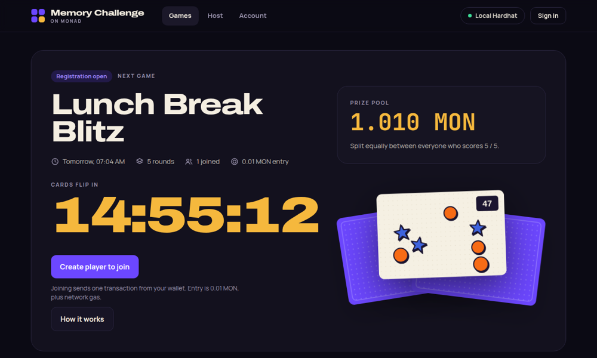
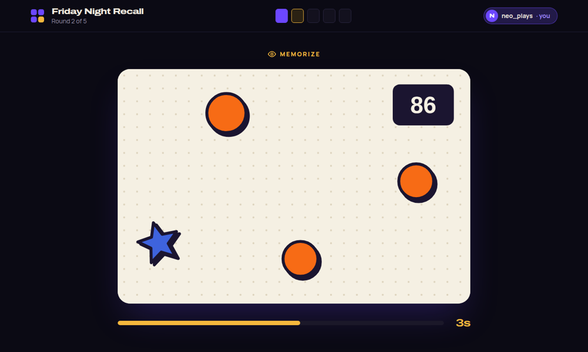
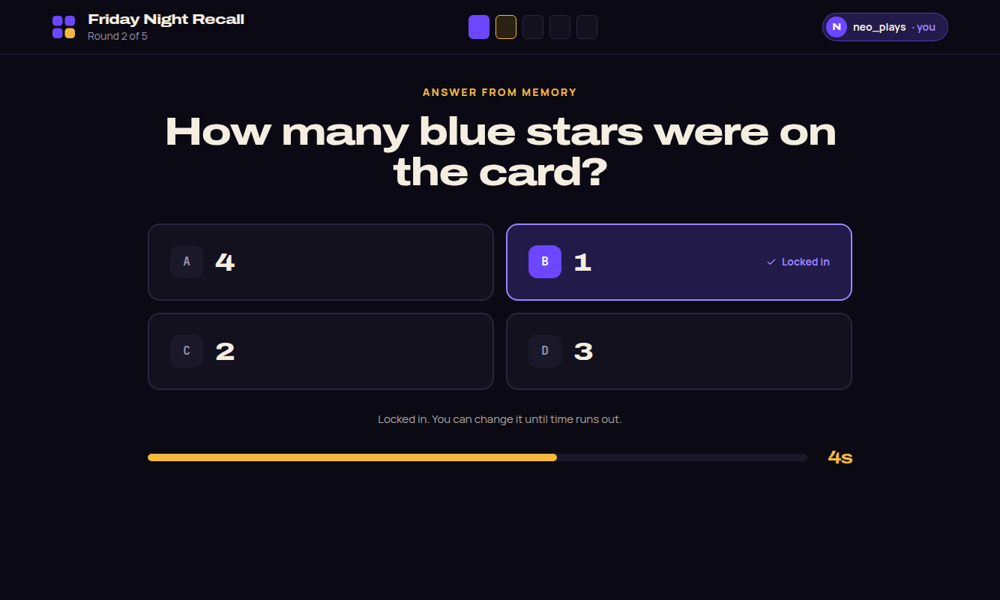
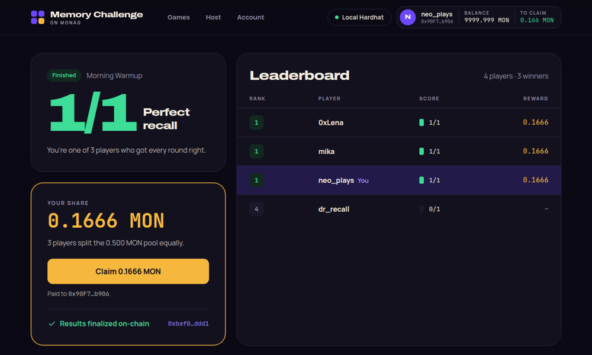

# Monad Memory Challenge

A scheduled, multiplayer memory game with on-chain prize pools on **Monad**. Players sign up with their email and a nickname, then connect a wallet and join a scheduled game. Everyone sees the same pictures at the same moment (5 seconds each) and then answers a question about each one (5 seconds each). Players who get every answer right split a MON prize pool that the smart contract holds and pays out.

| Games | Memory card (5 s) | Question (5 s) | Results |
|---|---|---|---|
|  |  |  |  |

## How it works

1. **Register:** email → 6-digit code → unique nickname → connect a wallet and sign a message to prove you own it. Email is never written on-chain.
2. **Browse games:** each card shows the start time in your timezone, a live countdown, registered players, the prize pool read from the contract, and a status (*Registration open*, *Starting soon*, *Live*, *Finished*).
3. **Join:** a wallet transaction (`joinGame`) registers you on-chain before the start. The button then becomes **Enter lobby**.
4. **Play:** at the scheduled time, memory card 1 appears for 5 s, then a question about it for 5 s, for up to 5 rounds. Everyone gets the same pictures and questions, and the answer order is shuffled per player. Refreshing the page doesn't restart anything.
5. **Results:** a leaderboard ranks nicknames by score, and equal scores share a rank. Perfect scores split the pool equally, and each winner claims their reward with **Claim**. If nobody gets a perfect score, the pool goes back to the organizer.

## 🟣 Built on Monad: where it's actually used

This is a Monad hackathon project, so to be explicit: **Monad is the blockchain that the game's whole money and ownership layer runs on.** Here is exactly where it shows up:

1. **The smart contract lives there** ([`contracts/contracts/MemoryGame.sol`](contracts/contracts/MemoryGame.sol)). Deployed to Monad testnet, it's the only place that touches actual funds: it holds each game's prize pool, tracks who registered, and pays out claims. It's EVM-compatible, so it's ordinary Solidity; Monad's pitch is just doing that faster and cheaper than Ethereum mainnet.
2. **Joining a game is a Monad transaction.** When a player clicks **Join game**, the browser calls `joinGame(gameId)` directly on the contract from their own wallet (MetaMask or similar, via wagmi/viem). It's a real on-chain transaction with a small gas fee, per the spec, even for free games.
3. **Balances are read directly from the chain.** The player's MON balance and each game's prize pool and player count are read live from Monad rather than trusted from the backend, so anyone can verify the numbers independently.
4. **Funding, finalizing and paying rewards happen on-chain.** Creating a game sends its prize pool into the contract (`createGame`). After a game ends, the backend grades it, builds a Merkle tree of `(wallet, amount)` for everyone who scored perfectly, and publishes the root with `finalizeGame()` from the operator wallet (another Monad transaction). Winners then call `claimReward()` themselves with a Merkle proof. The contract verifies the proof, pays out in MON and blocks double claims. The organizer can only ever withdraw the part of the pool that wasn't won.

**Where Monad is *not* involved:** the backend handles email verification, nicknames, revealing pictures and questions on schedule, and grading. A contract can't send emails or keep quiz answers secret, so that logic lives in a small API. It only ever tells the contract *who gets paid how much*; it never moves players' funds itself.

**In short:** joining and claiming are wallet-signed Monad transactions, games are funded and finalized on-chain, and balances and pool amounts are read straight from Monad. Everything else (content, timing, scoring) is regular backend logic that feeds the contract a final answer.

## Architecture

```
                         ┌──────────────── Vercel (one project) ────────────────┐
 Browser ── HTTPS ──────▶│  Static React app         /api/* serverless function │
  │  (wagmi / viem)      │  (Vite build)             (Express, bundled)          │
  │                      └───────────────────────────────┬──────────────────────┘
  │                                                      │
  │                               ┌──────────────────────┼─────────────────────┐
  │                               ▼                      ▼                     ▼
  │                        Postgres (Neon)        Resend (email)      Monad RPC (operator:
  │                        accounts, games,                            createGame /
  │                        answers, scores                             finalizeGame)
  │                                                                          │
  └──── joinGame / claimReward, balance reads ──────────────▶  MemoryGame.sol on Monad
```

- **Stateless by design.** A game's timeline is a pure function of its start time. The API computes the current phase on every request, and each browser runs the countdown and timer bars from a clock synced to the server. No background process has to "run" a game, which is what makes it work on serverless.
- **Content stays secret.** A picture is only sent during its 5-second window, and a question (never its answer) only during its window. Answers are checked against the server clock, with a 1.5 s grace period for network lag.
- **Results on demand.** The first request for a finished game's results grades it and publishes the rewards on-chain. The step is idempotent, and concurrent requests are safe.

## Technology

| Layer | Choice |
|---|---|
| Blockchain | **Monad testnet** (chain 10143, EVM) |
| Smart contract | **Solidity 0.8.24**, Hardhat, OpenZeppelin (`Ownable`, `ReentrancyGuard`, `MerkleProof`) |
| API | **Node.js + TypeScript + Express**, deployed as one **Vercel serverless function** |
| Database | **Postgres**: Neon (via the Vercel Marketplace) in production; embedded **PGlite** locally (nothing to install) |
| Email | **Resend** (verification codes) |
| Frontend | **React + Vite + Tailwind**, **wagmi + viem** for wallets |
| Game content | Procedurally generated **memory cards** (SVG): two sticker groups + a badge number, with the question generated from the same card so the answer is always exact |

## Repository layout

```
contracts/   MemoryGame.sol, tests (npm test), compile/deploy scripts
backend/     API: routes, Postgres layer, schedule, finalization, memory-card generator, e2e test
frontend/    React app: Games, Account, Lobby/Play, Results, Host (/host)
scripts/     vercel-build.mjs — builds the static site + API function for Vercel
start-local.sh   one-command local run
```

## Run it locally (one command)

Requires Node.js 20.19+ (22 recommended) and a browser wallet such as MetaMask.

```bash
./start-local.sh          # add --clean if you ever see "installed for another platform" errors
```

This starts a local chain, deploys the contract, starts the API (with an embedded database) and two demo games, then opens the web app at **http://localhost:5173**. The terminal prints the wallet network settings and a funded test account to import. Email codes are shown on screen locally. The Host page is at `/host`, with the admin key `dev-admin-key`.

Tests:
```bash
cd contracts && npm test                      # contract unit tests
# full flow against a running API + chain (see the header of backend/src/e2e/run.ts):
cd backend && npm run e2e
```

## Deploy online (Vercel + Monad testnet)

The frontend and the API deploy together as **one Vercel project** from the repo root; `vercel.json` handles the build. You need:

1. **An operator wallet on Monad testnet.** Create a *new* wallet just for this and fund it with test MON from the [faucet](https://faucet.monad.xyz). It deploys the contract, funds prize pools and publishes results, and its private key goes into Vercel.
2. **Deploy the contract** (from your computer):
   ```bash
   cd contracts && npm install
   DEPLOYER_PK=0xYOUR_OPERATOR_PRIVATE_KEY npm run deploy:monad
   ```
   Copy the printed `MemoryGame deployed to: 0x…` address.
3. **Push this repo to GitHub**, then in Vercel choose **Add New → Project** and import it. Leave the root directory as the repo root; the framework preset can stay as detected, because `vercel.json` sets the install and build commands.
4. **Add a database:** in the Vercel project, go to **Storage → Create → Neon (Postgres)** and connect it. That sets `DATABASE_URL` automatically. Tables are created on first use.
5. **Email:** create a [Resend](https://resend.com) API key. To email *anyone*, verify your sending domain in Resend and use an address on it. The test sender `onboarding@resend.dev` can only email your own Resend account address.
6. **Set environment variables** (Project → Settings → Environment Variables):

   | Name | Value |
   |---|---|
   | `CONTRACT_ADDRESS` | address from step 2 |
   | `OPERATOR_PRIVATE_KEY` | the operator wallet's private key |
   | `JWT_SECRET` | a long random string (e.g. `openssl rand -hex 32`) |
   | `ADMIN_KEY` | a password for the Host page |
   | `RESEND_API_KEY` | from Resend |
   | `EMAIL_FROM` | e.g. `Monad Memory Challenge <play@yourdomain.com>` |
   | `CHAIN_ID` | `10143` (default) |
   | `RPC_URL` | `https://testnet-rpc.monad.xyz` (default) |
   | `DATABASE_URL` | set by the Neon integration |

7. **Deploy** (or redeploy after adding the variables). Open `https://<your-app>.vercel.app/host`, enter your `ADMIN_KEY`, and schedule a game. It appears on the home page right away.

The frontend itself needs no environment variables; it reads the chain settings from `/api/config`.

## Rules published before registration opens

- Registration closes at the scheduled start time; there is no late entry.
- Joining requires an on-chain transaction (network fee), even for free-entry games.
- The funded prize pool is split equally among every player with a perfect score.
- If nobody gets a perfect score, the pool is returned to the organizer after finalization.

## Security notes

- The operator key is a hot wallet on the server. Keep only what you plan to put into prize pools in it, and use a dedicated wallet.
- The contract caps payouts at the allocation published for each game, and the organizer can't withdraw winners' unclaimed rewards.
- This is built and tested for **testnet**. Get the contract reviewed before running games with real funds.
